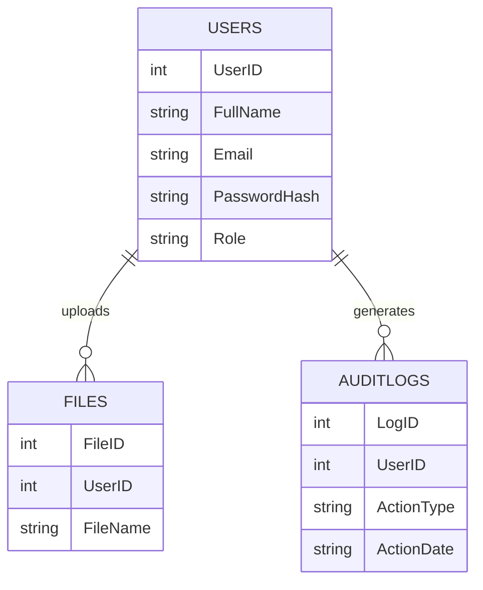
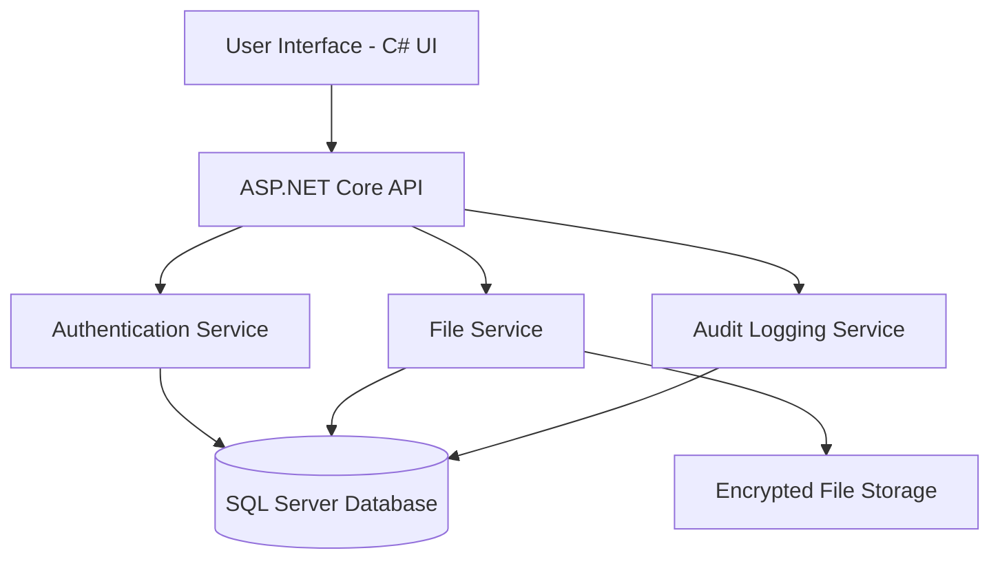

# SecureVault
This is a secure file storage and audit management system. It allows users to securely upload, store, retrieve, and manage files. The system incorporates mordern cybersecurity princeples such as password hashing, encrypted file storage, role -based access control, and audit logging. I have designed this to ensure that sensitive files remain protected, all while maintaining accountability through detailed activity tracking. 
every important action performed by users is recorded in an audit log, allowing administrators to monitor system activity and detect suspicious behaviour. Features commonly found in enterprise documemt management systems and secure cloud storage platforms are simulated in this project.
 
Problem statement- Organizations need a secure way to store and manage sensitive files while ensuring that only authorized users can access them. additionally, administrators require visibility into user activities to identify security incidents and maintain accountability. 

OBJECTIVES- to provide secure user authentication, to securely store uploaded files, to implement password hashing to protect user credentials, to implement file encryption before storage, to maintain detailed audit logs of user activities, to provide role base access control for users and administrators, to create an intuitive interface for file management.

TECHNOLOGIES: C#, Microsoft SQL Server, ASP.NET core web API, BCrypt password hashing, AES file encryption,Github.

1.AUTHENTICATION- registration, login, password hashing, session management. Table : Users
2. FILE MANAGEMENT-uploading files, downloading files, viewing files, deleting files. Table: Files
3.ENCRYPTION- encrypting uploaded files, decryptiong downloaded files.
4. AUDIT LOGGING- login, logout, upload, download, delete. Table: AuditLogs
5. ADMINISTRATION- viewing users, viewing audit logs, monitoring activity. Tables: Users & AuditLogs

EXPECTED OUTCOME: The completed system will demonstrate secure software development practices and provide a practical example of how cybersecurity principles can be integrated into modern applications. 

## Entity Relationship Diagram

## System Architecture

## Project Structure (Planned)

SecureVault/
│
├── SecureVault.API/        (Backend - ASP.NET Core)
├── SecureVault.UI/         (Frontend - C#)
├── SecureVault.Core/       (Business Logic)
├── SecureVault.Data/       (Database Layer)
├── SecureVault.Database/   (SQL Scripts)
├── docs/                   (Diagrams & Documentation)
└── README.md

## Future Improvements

- JWT authentication for secure sessions
- Two-factor authentication (2FA)
- File integrity verification (hash checking)
- Real-time security monitoring dashboard
- Cloud deployment (Azure / AWS)
